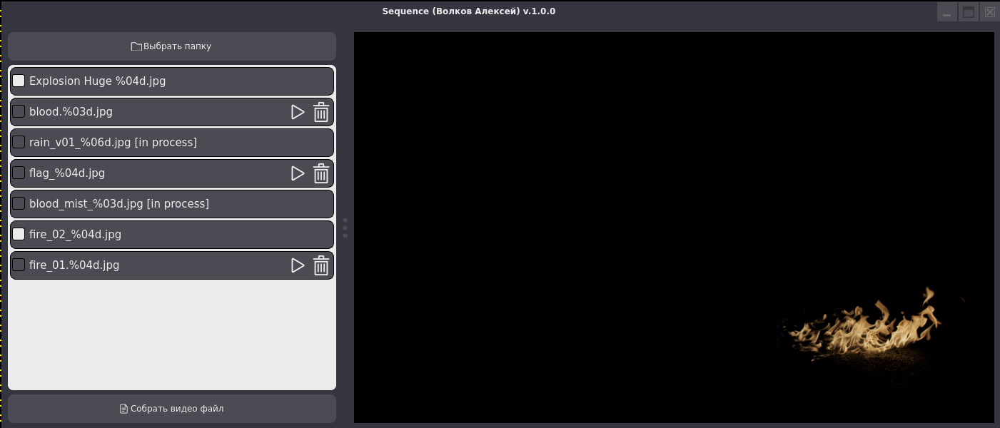

## Описание

Приложение для сборки видео из файлов секвенции.

Решен в рамках технического задания.

## Запуск.

- Для запуска необходимо установить зависимости из файла requirements.txt

- Переименуйте `config.template.ini` в `config.ini`

- В `config.ini` укажите место сохранение полученных видео файлов

- запустите main.py

> Для примера работы можно использовать файлы из папки examples.

> Приложение работает только из системы Linux.

## Пример того что должно получится

